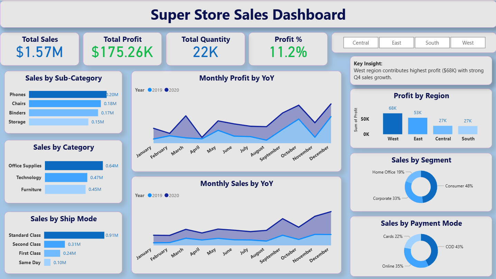

# Super Store Sales Dashboard | Power BI

## 📊 Project Overview
Designed and developed an interactive Sales Performance Dashboard to analyze revenue, profit margins, and regional trends.

## 🎯 Key Features
- KPI Tracking (Total Sales, Profit, Quantity, Profit %)
- YoY Sales & Profit Trend Analysis
- Regional Profit Breakdown
- Customer Segmentation Insights
- Dynamic Filtering & Drill-Down Analysis

## 🛠 Tech Stack
- Power BI
- DAX
- Power Query
- Data Modeling
- Excel

## 📸 Dashboard Preview

## 📈 Key Insight
West region contributes the highest profit with strong Q4 sales growth.

## 📂 How to Use
Download the .pbix file and open in Power BI Desktop to explore interactive features.

